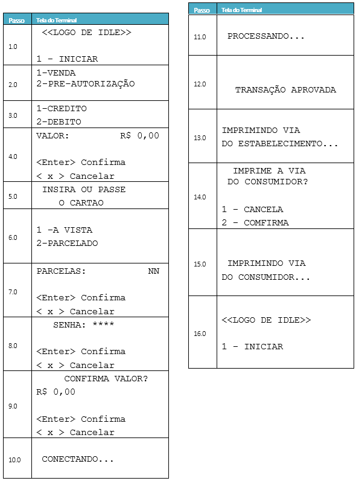

>O desafio já está solucionado mas caso queria tentar é só substituir o diretorio src pelo src_reset e apagar o script builder.py. Não prossegui com a vaga mas aprendi bastante fazendo esse processo seletivo, principalmente por causa dos feedbacks do dev Caio no dia do resultado final. Espero que ajude alguém que também está começando!

# Desafio Técnico - Dev Qualidade

## Introdução

Este é o projeto base para o desafio técnico para a vaga de desenvolvedor de Qualidade no time de Plataforma da Muxi. Implemente todas as etapas listadas a seguir nesse mesmo projeto.

1. Desenvolvimento: será solicitada a implementação de um script em Python para se atingir um determinado objetivo. Nesta etapa avaliaremos não só o seu conhecimento na linguagem, mas também a sua capacidade de raciocínio lógico e resolução de problemas.
2. Testes: será solicitado o projeto de testes para um determinado cenário. Nesta etapa, avaliaremos o seu conhecimento teórico e prático acerca de projetos de testes e elaboração de casos de teste do tipo "caixa-preta".

## Etapa 1 - Desenvolvimento

### Pedido

Considere uma aplicação já implementada que possui a estruturas de pastas visível no diretório `src` do presente repositório. Você deve implementar um script Python que realiza o build dessa aplicação, ou seja, que compila, movimenta e copia arquivos do diretório inicial do código-fonte para um diretório final, de carga, que será utilizado para rodar tal aplicação.

Baseado nos arquivos já inclusos no diretório `src`, o diretório final da carga terá a seguinte estrutura:

``` markdown
load\
    POSWEB\
        f\
            elbmp_c.bmp
            elbmp.bmp
            elbmpcvs.wml
            elbmpcvs.wsc
            elpinpad.wml
            elpinpad.wsc
            muxi.bmp
            pcancel.pwi
            pgrid.ini
            ppcfg.ini
            pwbbg.pwi
            pwf9x16.pwf
            pwf9x34.pwf
            pwinit.cfg
        i\
            config.ini
            openclose.db
            ptwsc.txt
            ptwscp.txt
            pwsfiles.txt
    flist.web
    ilist.web
```

### Passos do build

O build é composto dos seguintes passos:

* Criar uma pasta `load`, para receber a carga do sistema;
* Compilar arquivos: utilizar o programa `WMLSComp`, que se encontra na raiz do repositório, para compilar os arquivos .wmls. O compilador gera arquivos com a extensão .wmlsc. Uso do programa pela CLI:

``` bat
<caminho_do_compilador>\WMLSComp.exe <caminho_do_arquivo>\arquivo.wmls
```

* Renomear arquivos .wmlsc para .wsc;

A partir do diretório `src\POSWEB\`:

* Mover arquivos .wsc para o diretório `load\POSWEB\f\`;
* Copiar arquivos .wml para o diretório `load\POSWEB\f\`;
* Copiar arquivo config.ini para o diretório `load\POSWEB\i\`;
* Copiar arquivos em `src\POSWEB\db\` para `load\POSWEB\i\`;
* Copiar arquivos em `src\POSWEB\images\` para `load\POSWEB\f\`;

Demais cópias a partir do diretório `src\`:

* A partir do diretório `src\_font`, copiar **APENAS** arquivos com extensão .pwf para `load\POSWEB\f\`;
* Copiar arquivos de `src\_theme\` para `load\POSWEB\f\`;
* Copiar arquivos de `src\_minimal\` para `load\POSWEB\i\`;

No diretório `load\POSWEB\`:

* Criar arquivos `flist.web` e `ilist.web`, que vão conter uma lista de arquivos nos diretórios `load\POSWEB\f\` e `load\POSWEB\i\`, respectivamente, um arquivo por linha.

### Observações

* Os arquivos do diretório `src` podem variar, ou seja, é possível ter mais arquivos .wml dentro do diretório `src\POSWEB`. No entanto, a estrutura de pastas pode ser considerada imutável;
* A inclusão de testes unitários não é obrigatória, mas é um diferencial na sua avaliação. Utilize o pacote `pytest`, se for incluir testes. Mantenha todos os seus arquivos de teste em um diretório específico, como na estrutura de exemplo abaixo:

``` markdown
build\
    module\
        module.py
    main.py
    app.py
src\
    [...]
test\
    module\
        test_module.py
    test_main.py
    test_app.py
```

## Etapa 2 - Projeto de Testes

Para esta etapa, responda às questões de acordo com o seu conhecimento e sua experiência em projetos de testes. Caso ache necessário, suba arquivos adicionais nesse projeto através de novos _commits_ (pdfs, docs, etc.).

### Questão 1

Dado que um site de uma loja virtual (ex.: www.submarino.com.br) apresentou um erro pontual (_hotfix_) no processo de pagamento com cartão de crédito:

a) Descreva uma estratégia de teste para certificar se o processo de pagamento foi corrigido;

b) Quais etapas você considera obrigatórias e opcionais - caso não haja tempo suficiente para teste - no processo de certificação para que a entrega seja realizada com qualidade?

### Questão 2

O fluxo de telas abaixo representa uma aplicação executada em uma máquina de venda que utiliza cartões de débito e crédito físicos. O teclado numérico da máquina é utilizado para selecionar itens de menu e digitar valores de venda.



A partir do fluxo de telas acima, descreva casos de teste (quantos forem necessários) para os seguintes cenários:

a) Transação de venda a débito com cartão de tarja magnética no valor de R$100,50. A transação é aprovada após digitação da senha e o cliente solicita impressão de sua via do comprovante.

b) Validação do seguinte requisito: As quantidades mínima e máxima de parcelas em vendas crédito é 2 e 10 respectivamente. Para valores diferentes, deve ser exibida a mensagem “Número de parcelas inválido” e voltar a tela anterior.
